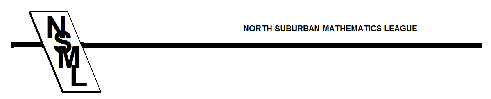

# General Regulations for NSML Meets

1. Schools on strike may not compete.
2. Students below the 9th grade may not compete as contestants, but may compete as
alternates.
3. NSML rules and proctor scripts are posted on the League’s website ([www.nsml.org](https://www.nsml.org)).
4. Cell phones must be turned off and not visible during the contest. If a cell phone goes off
during a contest, the student will be disqualified for that event for that meet. If a cell
phone is visible, the proctor will request that the student put it away. If the student does
not comply, the student will be disqualified for that event for that meet. Disqualification
in these circumstances means that a student will get a score of zero for the contest the
student is taking. The student may compete at other meets, or, if the violation occurs in
the first round, the student may compete at another level in the second round that night.
No oralist may have a cell phone with them in the sequester or preparation rooms. An
oralist who violates this rule will be disqualified for the entire evening. Make your
proctors aware of this rule.
5. Head coaches: It is important for the League President to have correct contact information
to reach you in case of an emergency, scoring change, or other announcement. Please
make sure that your contact information on the League’s website is current. Several days
before the meet, the League president will ask you by e-mail to verify your contact
information.
6. (Appeals.) Member schools are responsible for knowing the League’s
rules regarding appeals and for submitting appeals in accordance with
the rules.  The host school is not involved at all in handling
appeals, or responsible for answering questions about procedure.
Any questions about procedure can be directed to the League President.
